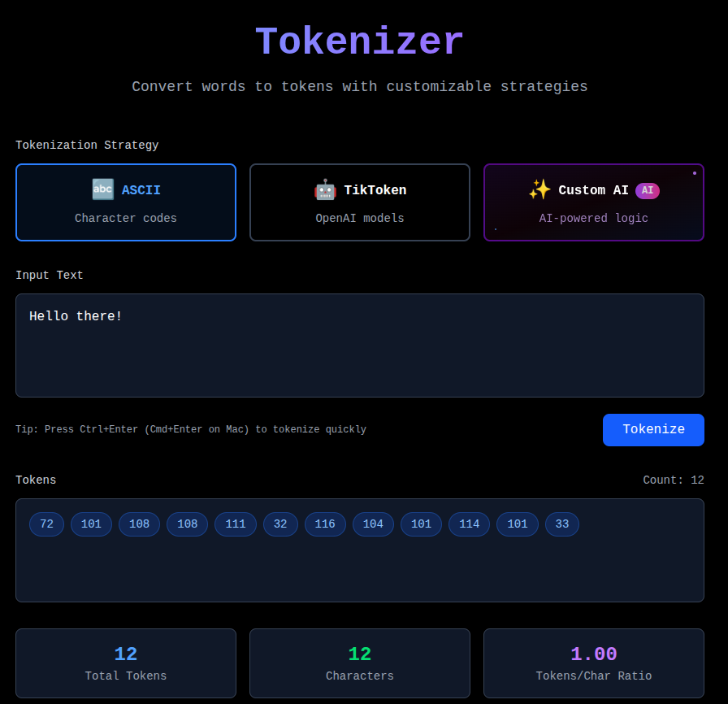
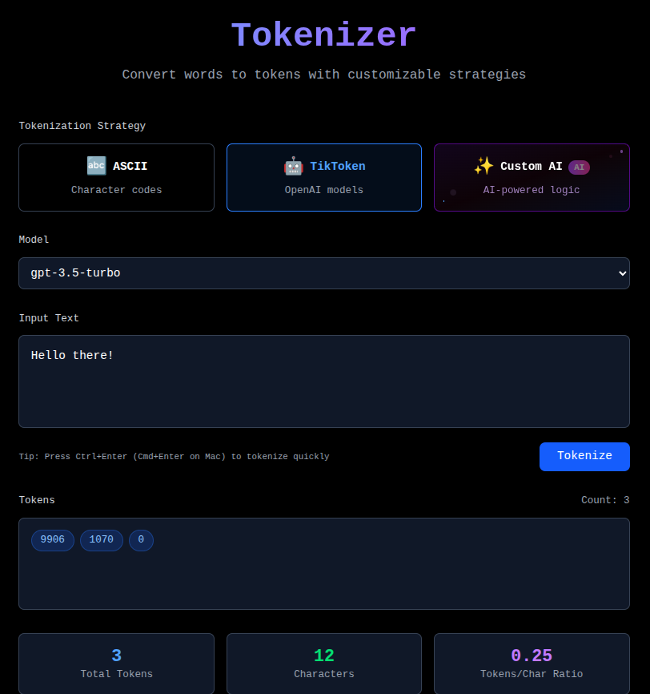
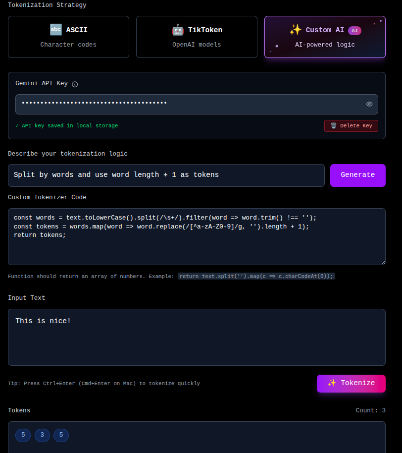

# 🔤 AI-Powered Tokenizer

AutoTokenizer is a modern, minimalistic web application that converts text to tokens using multiple tokenization strategies including ASCII, TikToken (OpenAI), and custom AI-generated logic.

## ✨ Features

- **🔤 ASCII Tokenization**: Convert characters to ASCII codes
- **🤖 TikToken Integration**: Use OpenAI's tokenization models (GPT-4, GPT-3.5-turbo, etc.)
- **✨ AI-Powered Custom Logic**: Describe tokenization strategy in plain English and let AI generate the code
- **🔒 Secure API Key Management**: Client-side storage with easy deletion
- **📱 Responsive Design**: Works seamlessly on desktop and mobile
- **🎨 Modern Dark UI**: Minimalistic design with smooth animations
- **⚡ Real-time Processing**: Fast tokenization with visual feedback

## 🚀 Technologies Used

- **Frontend**: React 18, Vite
- **Styling**: Tailwind CSS v4
- **Tokenization**: js-tiktoken library
- **AI Integration**: Google Gemini API
- **HTTP Client**: Axios
- **Font**: JetBrains Mono

## 📦 Installation & Setup

### Prerequisites
- Node.js (v16 or higher)
- npm or yarn

### Steps

1. **Clone the repository**:
- `git clone https://github.com/gautam1228/smart-tokenizer.git`

- `cd tokenizer-app`

2. **Install dependencies**
- `npm install`

3. **Start development server**
- `npm run dev`

4. **Open in browser**
- `http://localhost:5173`

## 🎯 Usage

### 1. ASCII Tokenization

- Select "ASCII" strategy
- Enter any text
- Click "Tokenize" to see character codes

**Example:**

### 2. TikToken (OpenAI Models)

- Select "TikToken" strategy
- Choose your desired model (GPT-4, GPT-3.5-turbo, etc.)
- Enter text and tokenize

**Example:**

### 3. Custom AI-Generated Logic

- Select "Custom AI" strategy
- Add your Gemini API key (stored securely in browser)
- Describe your tokenization logic in plain English
- Click "Generate" to create custom code
- Edit the generated code if needed
- Tokenize your text

**Example:**

## 🔑 API Key Setup (Optional)

To use the Custom AI tokenizer feature:

1. Get a free API key from [Google AI Studio](https://ai.google.dev)
2. In the Custom AI tab, enter your API key
3. Your key is stored securely in browser local storage
4. Use the delete button to remove it anytime

**🔒 Security Note**: Your API key never leaves your browser and is not sent to our servers.
